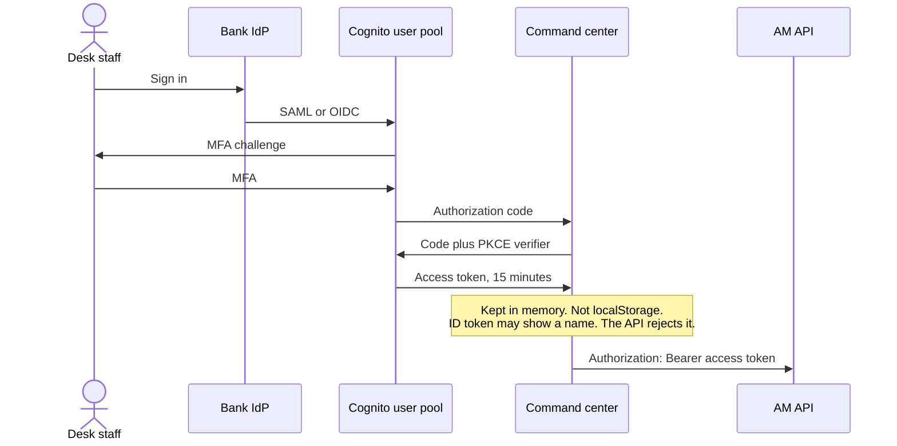
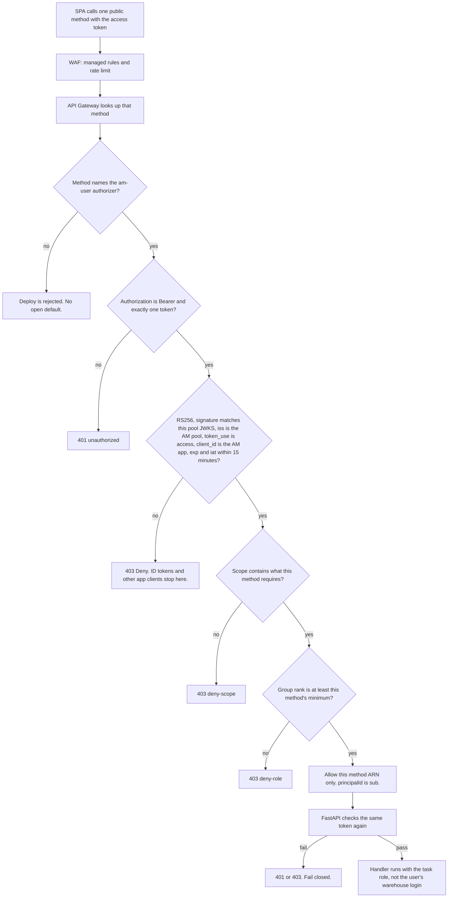

# AM backend services

Design for the command-center API. Aggregates come from Databricks. Transactions, alerts, thresholds, and acknowledgements live in DynamoDB. Every caller-facing API has an authorizer. A route with no authorizer is not deployed.

This is the target design. The running app still serves a local simulator and checks the JWT inside FastAPI. Production adds the gateway authorizer in front of that check and replaces the simulator with the two stores below.

## What the API is for

AM watches corporate transactions from as many as 26 systems of record. The transactions belong to companies, not to retail customers. A transaction moves through payment processing, fraud check, balance check, and then completed or cancelled.

The command center defines a threshold on a dataset from one system. When that dataset arrives, the threshold is applied. A breach opens an alert. The desk acknowledges the alert and records a status: not an alert, acknowledged, talked to the downstream system, and the other dispositions already used on the desk.

Two kinds of read fall out of that:

- **Aggregates** answer "how is the book doing": volume, value, success, latency, throughput, system health, pipeline counts, whether a threshold is currently breaching. Those are warehouse questions. They come from Databricks.
- **Transactions** answer "which payment, which alert, who acknowledged it": the blotter, the alert worksheet, threshold definitions, and the status note. Those are item lookups. They come from DynamoDB.

The browser never talks to Databricks or DynamoDB. It talks only to the AM API.

## Services

```
Command center (React)
    │  Authorization: Bearer <Cognito access token>
    ▼
CloudFront + WAF
    ▼
API Gateway
    │  every method references an authorizer
    ├─ authorizer: am-user     human callers
    └─ authorizer: am-ingest   system callers only, separate API
    ▼
AM API  (FastAPI on ECS Fargate, private subnets)
    ├─ Aggregate reader  → Databricks SQL warehouse (service principal)
    ├─ Transaction store → DynamoDB (task IAM role)
    └─ Desk assistant    → those two readers only, no free-form SQL
Ingest and threshold worker (not on the user API)
    ├─ systems of record → stream / file landing
    ├─ Databricks job    → gold aggregates and breach evaluation
    └─ writer            → DynamoDB transactions and alerts (its own IAM role)
```

One API process is enough for about 100 users a day. Splitting aggregate reads and transaction reads into two deployables would add network hops without changing the trust boundary. They stay as two adapters behind one service. The authorizer is a separate function because it has to run before the API and it must not hold data-plane credentials.

| Service | Runs as | Holds credentials for | Called by |
|---|---|---|---|
| `am-user` authorizer | Lambda | Cognito JWKS only | API Gateway, once per user request |
| AM API | Fargate task | Databricks service principal, DynamoDB read/write for desk tables | API Gateway, after Allow |
| Ingest and threshold worker | Databricks job + small writer | Warehouse identity, DynamoDB write on transactions and alerts | Schedule and upstream feeds, not the UI |
| `am-ingest` authorizer | Lambda or IAM | Verifies a workload identity | Only if a system must push over HTTPS |

## Databricks — aggregate data

Databricks is the system of record for numbers that are already rolled up. The API does not scan raw payments there to draw the blotter.

Gold objects the API is allowed to read:

| Object | Used by | Grain |
|---|---|---|
| `am.gold.kpi_window` | `GET /api/kpis` | One row per metric window (15 minutes) |
| `am.gold.throughput` | `GET /api/throughput` | Counts per time bucket |
| `am.gold.system_health` | `GET /api/channels`, `GET /api/systems` | One row per system of record and dataset |
| `am.gold.pipeline` | `GET /api/pipeline` | Counts by transaction state |
| `am.gold.threshold_eval` | Threshold desk, breach flag | Latest actual value versus the limit |

Unity Catalog grants for the AM service principal are `SELECT` on those objects and nothing else. No `MODIFY`, no access to bronze or to raw account-number columns. Column masks in Unity Catalog drop or hash any account identifier that survived into gold. The API still masks before it responds, so a bad grant does not become a full account number on the screen.

How the API connects:

- A Databricks service principal, OAuth machine-to-machine. The client secret lives in Secrets Manager. The task role can read that secret and cannot read unrelated secrets.
- The API calls the SQL Statement Execution API against one SQL warehouse. The warehouse id is configuration, never a request parameter.
- Statements are fixed text in the service, with bound parameters for window and system code. User text, including chat, is not concatenated into SQL.
- The OAuth token is cached in memory on the task and refreshed before expiry. It is not written to logs or to DynamoDB.
- The warehouse and the VPC meet over PrivateLink where the bank requires it. The browser cannot reach the warehouse hostname.

Threshold evaluation runs in Databricks, next to the data. A job compares the latest aggregate to the threshold definition and writes a breach record. A writer then opens an alert in DynamoDB if that system, dataset, and metric does not already have an open alert. The user API only reads `threshold_eval` to show the current actual and the breaching flag.

## DynamoDB — transactional data

DynamoDB holds items the desk opens, filters, and updates one at a time.

| Table | Keys | Holds |
|---|---|---|
| `am_transactions` | `pk = TXN#<id>`, GSI `gsi1` = system + time, GSI `gsi2` = state + time | One corporate transaction: id, time, company, counterparty, masked account, system, dataset, amount, currency, state, dwell |
| `am_alerts` | `pk = ALERT#<id>`, GSI `gsi1` = queue + time | Open and acknowledged alerts, the sample transaction, the breach numbers, disposition, note, owner |
| `am_thresholds` | `pk = TH#<id>`, GSI `gsi1` = system + dataset | The rule the desk defined: metric, operator, limit, window, severity, enabled |
| `am_audit` | `pk = ALERT#<id>`, `sk = <timestamp>` | Append-only history of status changes. The API inserts here. It does not update or delete. |

Account numbers are masked before the item is written. The API never stores or returns a full account number. Tables use a customer-managed KMS key, point-in-time recovery, and deletion protection. The API role may `GetItem` and `Query` on the indexes above. It may `PutItem` and `UpdateItem` only on alerts, thresholds, and audit. It may not `Scan`, and it may not write `am_transactions`. Transaction items are written by the ingest role.

An acknowledgement is a conditional update: the alert must exist, the note must meet the rule for that disposition, and the queue moves to `ACKNOWLEDGED`. The same call writes an audit item. A lost race returns 409 rather than overwriting someone else's note.

## API catalog

Each row is a method on the public API. Each one has the `am-user` authorizer. "Min role" is enforced in the authorizer and again in FastAPI.

| Method | Path | Min role | Scope | Store | Purpose |
|---|---|---|---|---|---|
| `GET` | `/api/me` | viewer | `am/read` | none | Who the token says the caller is |
| `GET` | `/api/kpis` | viewer | `am/read` | Databricks | Headline metrics for the monitor |
| `GET` | `/api/throughput` | viewer | `am/read` | Databricks | Volume over the recent window |
| `GET` | `/api/channels` | viewer | `am/read` | Databricks | Health by system of record |
| `GET` | `/api/systems` | viewer | `am/read` | Databricks | The 26 systems and their datasets |
| `GET` | `/api/pipeline` | viewer | `am/read` | Databricks | Counts by transaction state |
| `GET` | `/api/events` | viewer | `am/read` | DynamoDB | Transaction blotter |
| `GET` | `/api/alerts` | viewer | `am/read` | DynamoDB | Open, acknowledged, or all alerts |
| `GET` | `/api/thresholds` | viewer | `am/read` | DynamoDB rules, Databricks for the live actual | Threshold desk |
| `POST` | `/api/chat` | viewer | `am/read` | both, read only | Desk assistant |
| `POST` | `/api/alerts/{id}/disposition` | analyst | `am/write` | DynamoDB | Acknowledge and record the status note |
| `POST` | `/api/thresholds` | analyst | `am/write` | DynamoDB | Define a threshold for one dataset |
| `PATCH` | `/api/thresholds/{id}` | analyst | `am/write` | DynamoDB | Change limit, window, severity, or enabled |

`GET /api/thresholds` is the one call that touches both stores: the rule from DynamoDB, the current actual from `am.gold.threshold_eval`. The authorizer does not care. The API does both reads with its own credentials after the caller is allowed.

Chat may call the same read functions the screens use. It may not open a warehouse connection with the user's sentence as SQL, and it may not write an acknowledgement. Writing a status stays on `POST /api/alerts/{id}/disposition`, which requires `analyst`.

### Routes that are not on the public API

| Route | Authorizer | Where it lives |
|---|---|---|
| `GET /healthz` | none | Private, on the task. The load balancer calls it. API Gateway does not expose it. |
| `GET /api/dev-token` | none | Local process only, when `ENV` is not `prod`. The production image does not register it. There is no gateway method. |
| `GET /docs`, `GET /openapi.json` | none | Same as the dev token. Off in production. |
| Ingest `PUT` of a transaction or a breach | `am-ingest` | A different API, or no HTTP API at all if the feed is a Databricks job. It never uses `am-user`. |

A deploy check fails if any method on the public API has authorization type `NONE`, or if `/healthz` or `/api/dev-token` appears in the public OpenAPI import.

## Authentication

Authentication answers "who is calling." Authorization answers "may this caller hit this method." Both happen before FastAPI sees the body. FastAPI repeats the authorization check so a route that was imported without an authorizer still rejects the call.

### How a desk user is authenticated

The SPA never sends a password to the API. Cognito proves who the caller is and returns an access token. The API accepts only that access token.



The access token must be minted for the AM app client. Its `token_use` is `access`. Its scope is `am/read`, and `am/write` as well when the caller may acknowledge alerts or edit thresholds. `cognito:groups` is one of `viewer`, `analyst`, or `admin`. A refresh token stays at Cognito and is rotated. Production does not accept the local HMAC dev token.

### How each API call is authorized

Authentication stops at a valid access token. Authorization is a second decision, made twice: API Gateway's `am-user` authorizer, then `require_role` inside FastAPI. Either denial stops the call. A valid viewer token is still denied on a write.



Read methods in the catalog require `viewer` and `am/read`. Write methods (`POST /api/alerts/{id}/disposition`, `POST /api/thresholds`, `PATCH /api/thresholds/{id}`) require `analyst` and `am/write`. Rank is inclusive upward, so an analyst passes a viewer check and an admin passes both. A token with no group passes nothing.

`Allow` names the method that was evaluated, not `execute-api:/*/*`. A decision cached for `GET /api/alerts` is not reused for the disposition method. The cache key is the full `Authorization` header and the TTL is 60 seconds.

`/healthz` is not on this path. It has no token check and it is not mapped on API Gateway. Ingest does not use `am-user` or a Cognito token. A system of record reaches `am_transactions` only through `am-ingest` (IAM SigV4 or mutual TLS) or through the Databricks writer. A stolen desk token cannot post a transaction.

Locally, when `ENV` is not `prod` and `COGNITO_JWKS_URL` is empty, there is no gateway authorizer. FastAPI still runs `require_role`, and it accepts the HMAC token from `GET /api/dev-token`. That route is not mounted in production.

### Identity

Human users are command-center staff. They sign in through the bank IdP. Cognito is the user pool in front of that IdP (SAML or OIDC). The pool requires MFA. Users sit in one group:

| Group | Rank | Can |
|---|---|---|
| `viewer` | 1 | Read the monitor, blotter, alerts, thresholds, and ask the assistant |
| `analyst` | 2 | Everything a viewer can do, plus acknowledge an alert and define or edit a threshold |
| `admin` | 3 | Everything an analyst can do. Reserved for pool and threshold administration. |

Rank is inclusive upward. An analyst passes a viewer check. A token with no group does not pass any check. The API does not invent a viewer role for a missing claim.

The SPA uses Authorization Code with PKCE. It asks for an access token whose client id is the AM app client and whose scopes include `am/read`. Analysts who will acknowledge alerts also receive `am/write`. The access token lifetime is 15 minutes. The refresh token stays server-side at Cognito and is rotated. The SPA keeps the access token in memory. It does not put the token in `localStorage`.

An ID token is for the SPA to show a name. It is not accepted on the API. A token minted for a different app client is not accepted, even if the same user pool signed it.

### The authorizer on every API

There is one Lambda, `am-user`. Every public method sets:

- authorization type `CUSTOM`
- authorizer id = `am-user`
- identity source = `method.request.header.Authorization`

Sharing one function is required. Sharing one "auth optional" flag is not. Each method's configuration names the authorizer. Adding a route without that field is a failed deploy, not a default of open.

The authorizer is a REQUEST authorizer. It receives the method ARN, so the allow policy names that method and not `execute-api:/*/*`. A token that may read alerts cannot be replayed against the disposition method just because the token was valid somewhere else.

API Gateway invokes the authorizer and then, on Allow, proxies to the Fargate task. The authorizer's IAM role can write logs and fetch the Cognito JWKS. It cannot read DynamoDB, Secrets Manager, or Databricks. It makes no network call except to the JWKS URL (cached). A bug in the authorizer cannot become a data leak.

### What the authorizer checks, in order

1. `Authorization` is present, the scheme is `Bearer`, and there is exactly one token. Anything else is Deny, surfaced as 401.
2. The token has three segments. `alg` in the header is `RS256`. `none`, `HS256`, and any other algorithm are Deny. The production authorizer does not share the dev HMAC secret.
3. The signature matches the key id in the Cognito JWKS for this user pool. Unknown `kid` is Deny. JWKS is cached and refreshed on an unknown `kid` once, then denied if it is still unknown.
4. `iss` is the AM user pool. `token_use` is `access`. `client_id` is the AM app client. An ID token fails here.
5. `exp` is in the future and `iat` is in the past, with 60 seconds of clock skew. `exp - iat` is at most 15 minutes. A long-lived token is Deny even if the signature is good.
6. `scope` contains the scope that method requires (`am/read` or `am/write` from the catalog).
7. `cognito:groups` contains a group whose rank is at least the method's minimum role.
8. On success, return Allow for this method ARN only. `principalId` is `sub`. Context passed downstream, all strings: `sub`, `groups`, `scope`. On failure, return Deny. Do not throw. A thrown authorizer becomes a 500 and is harder to tell apart from an outage. Deny is 403 at the gateway. Missing or malformed credentials are answered as 401 by using the gateway's unauthorized response for those two cases, and Deny for a well-formed token that lacks role or scope.

The authorizer does not log the token, the refresh token, or the `Authorization` header. It logs the request id, the method ARN, `sub` when the token parsed, and the decision (`allow`, `deny-signature`, `deny-role`, `deny-scope`, `unauthorized`).

### Authorizer cache

API Gateway may cache the decision. The cache key is the identity source, which is the full `Authorization` header, so two users do not share an entry. TTL is 60 seconds, shorter than the access token. The cache is not keyed on a header the browser can omit. A policy cached for `GET /api/alerts` is not reused for `POST /api/alerts/{id}/disposition`, because the policy resource is the method ARN that was evaluated.

### Second check inside the API

FastAPI keeps `require_role` on every route, including routes that already passed the authorizer. It validates the same access token again: signature, issuer, `token_use`, client id, expiry, group rank, and scope. The reason is drift. A method added in code and forgotten in the gateway import must still fail closed.

The service ignores client-supplied `x-sub`, `x-role`, and similar headers. Identity comes from the bearer token. Gateway authorizer context is a hint for logs. It is not the source of truth, because the service has to be safe if something else on the VPC calls the task directly. The task security group allows ingress only from the API Gateway VPC link (or the internal ALB in front of the tasks). A developer laptop cannot call the task.

`/healthz` on the task does not check a token. It returns only `{"status":"ok"}`. It is not mapped on API Gateway.

### How a call runs

`GET /api/kpis` (aggregate):

1. SPA sends the access token.
2. WAF applies managed rules and a rate limit.
3. API Gateway invokes `am-user` for `GET /api/kpis`.
4. Authorizer checks the access token and that the caller has `viewer` and `am/read`. Allow names only that method.
5. FastAPI checks the token again, then the aggregate reader runs the fixed KPI statement on the SQL warehouse with the service principal.
6. The response is the metric row. No account numbers.

`GET /api/events` (transactional):

1. Same authorizer path, same role and scope.
2. FastAPI queries `am_transactions` on `gsi1` or `gsi2` with the limit and optional state or system. The limit is capped at 300.
3. Account fields are already masked. The handler checks the mask before returning and drops the item if it is not masked.

`POST /api/alerts/{id}/disposition` (transactional write):

1. Authorizer requires `analyst` and `am/write`. A viewer token is a valid signature and still Deny.
2. FastAPI checks the role again, checks the disposition against the allowed list, and requires a status note except for a bare acknowledgement.
3. Conditional update on `am_alerts`, then an insert on `am_audit` with `sub` as the owner.
4. The user's Databricks identity is never involved. The write is DynamoDB with the task role.

`POST /api/chat`:

1. Authorizer requires `viewer` and `am/read`. Chat does not grant write.
2. The handler classifies the question and calls the same aggregate and alert readers. The reply is built from those results.
3. The question is logged as an audit event with `sub` and request id. The question is not sent to the warehouse as SQL.

### Ingest does not reuse the user authorizer

Systems of record are not people and they do not use the SPA. Their path is a Databricks pipeline, or a private ingest API with the `am-ingest` authorizer.

`am-ingest` is a different Lambda. It accepts only IAM SigV4 from a named role, or a mutual-TLS client certificate mapped to that workload. It does not accept a Cognito user token. A stolen desk token cannot post a fake transaction. The ingest role can write `am_transactions` and cannot update dispositions.

### Local development

When `ENV` is not `prod` and `COGNITO_JWKS_URL` is empty, FastAPI accepts the local HMAC token from `GET /api/dev-token`. That route is how a developer signs in without Cognito. Production sets `ENV=prod`, sets the JWKS URL, and does not mount `/api/dev-token`. The dev secret is not present in the production task definition. The gateway authorizer does not exist in this local mode. The in-process check still runs, which is what the tests cover.

### Audit

Every authenticated call writes one audit line: request id, `sub`, method, path, status, and duration. Disposition and threshold changes also write a `am_audit` item that includes the previous and new status. CloudTrail covers the gateway, the authorizer, DynamoDB data events on the four tables, and Secrets Manager reads. Authorizer Deny and 401 are metrics with an alarm. JWKS fetch failures are an alarm. They are not silently retried into an Allow.

### What this refuses

- A public method with no authorizer.
- An ID token, or an access token for another app client, on any AM method.
- HS256 in production.
- A viewer calling a write method.
- The API using a human's Databricks user, or embedding a warehouse token in the SPA.
- Chat, or any query string, becoming SQL text.
- `Scan` on the transaction table.
- The authorizer role reading business data.
- Full account numbers in DynamoDB, in logs, or in an API response.
