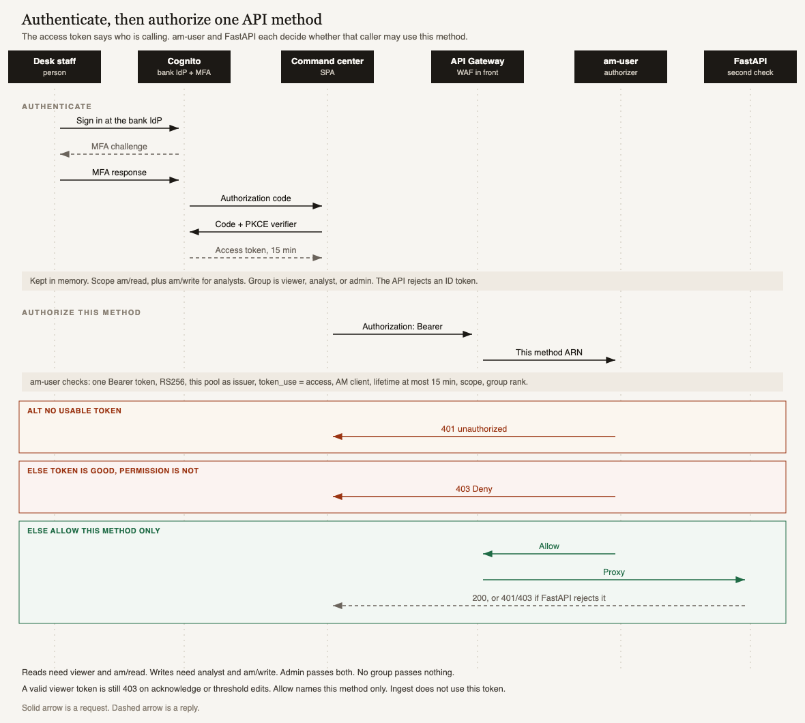

# Authenticate, then authorize one API method

The command center never sends a password to the API. Cognito proves who is calling. `am-user`, then FastAPI, decide whether that caller may use this one method.

Solid arrows are requests. Dashed arrows are replies.

Reads need `viewer` and `am/read`. Writes need `analyst` and `am/write`. Admin passes both. A token with no group passes nothing. A valid viewer token is still denied on acknowledge or threshold edits. Ingest does not use this token.
